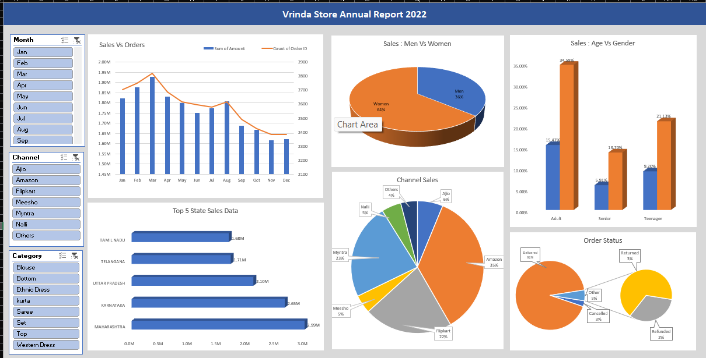

# 📊 Vrinda Store Annual Sales Analysis – 2022

An end-to-end **Microsoft Excel data analytics project** analyzing Vrinda Store's 2022 sales data to understand customer behavior, sales performance, order status, geographic trends, product performance, and sales-channel contribution.

The project demonstrates how raw business data can be transformed into meaningful insights using **data cleaning, Excel formulas, Pivot Tables, Pivot Charts, slicers, and an interactive dashboard**.

---

## 🎯 Business Objective

Vrinda Store wants to understand its **2022 sales performance and customer purchasing behavior** to identify opportunities for increasing sales and improving marketing strategies.

This analysis answers key business questions such as:

- How do sales and orders vary throughout the year?
- Which months generated the highest sales and order volumes?
- Which gender contributes more to sales?
- What is the distribution of order statuses?
- Which states generate the most sales?
- Which age groups contribute the most to sales?
- Which sales channels perform best?
- Which product categories generate the highest sales?

---

## 🗂️ Dataset

The dataset contains **order-level sales information for Vrinda Store for 2022**.

### Key Columns

| Column | Description |
|---|---|
| `Order ID` | Unique identifier for each order |
| `Cust ID` | Customer identifier |
| `Gender` | Customer gender |
| `Age` | Customer age |
| `Age Group` | Customer age category |
| `Date` | Order date |
| `Month` | Order month |
| `Status` | Order status |
| `Channel` | Sales channel |
| `SKU` | Product SKU |
| `Category` | Product category |
| `Size` | Product size |
| `Qty` | Quantity ordered |
| `Amount` | Order amount |
| `ship-city` | Shipping city |
| `ship-state` | Shipping state |
| `ship-postal-code` | Shipping postal code |
| `ship-country` | Shipping country |
| `B2B` | Indicates whether the order is a B2B order |

---

## 🛠️ Tools & Technologies

- **Microsoft Excel**
- Excel Tables
- Excel Formulas
- Pivot Tables
- Pivot Charts
- Slicers
- Data Cleaning
- Data Processing
- Data Visualization
- Dashboard Design
- Business Analysis

---

# 🔄 Project Workflow

The project follows an end-to-end data analytics workflow:

```text
Raw Data
   ↓
Data Cleaning
   ↓
Data Processing
   ↓
Pivot Tables
   ↓
Data Analysis
   ↓
Data Visualization
   ↓
Interactive Dashboard
   ↓
Business Insights
   ↓
Recommendations
```

---

# 🧹 1. Data Cleaning

The raw dataset was reviewed and prepared for analysis.

The cleaning process included:

- Reviewing the raw dataset
- Checking for data quality issues
- Identifying missing or inconsistent values
- Standardizing categorical fields where required
- Preparing date-related fields
- Organizing the dataset into a structured format
- Ensuring the dataset was suitable for Pivot Table analysis

---

# ⚙️ 2. Data Processing

Additional analytical fields were prepared to make the dataset easier to analyze.

Important fields included:

- Month
- Age Group
- Gender
- Order Status
- Sales Channel
- Product Category
- State

These fields were used to segment customers and analyze sales performance across different business dimensions.

---

# 📈 3. Data Analysis

The analysis focused on several key areas of the business.

### 📅 Sales vs. Orders

Monthly sales and order volumes were compared to identify seasonal trends and determine the strongest-performing months.

### 👩‍🦰 Men vs. Women

Sales and order contributions were analyzed by gender to understand which customer segment contributes more to overall sales.

### 📦 Order Status

Orders were analyzed according to their status, including:

- Delivered
- Returned
- Cancelled
- Refunded
- Other

This provides an overview of the order fulfillment and return pattern.

### 🗺️ Top States

Sales were analyzed by state to identify the strongest geographic markets.

### 👥 Age Group & Gender

Customers were segmented by age group and gender to understand the demographic profile of the store's customer base.

### 🛒 Sales Channels

Sales performance was compared across major channels, including:

- Amazon
- Flipkart
- Myntra
- Ajio
- Meesho
- Nalli
- Others

### 👕 Product Categories

Product categories were analyzed to identify categories that contribute significantly to overall sales.

---

# 📊 4. Pivot Tables

Pivot Tables were used to summarize and analyze the large order-level dataset.

The major Pivot Table analyses included:

- Monthly sales and order analysis
- Gender-wise sales/orders
- Order status distribution
- State-wise sales
- Age group vs. gender
- Channel-wise sales
- Category-wise sales

Pivot Tables made it easier to aggregate, filter, compare, and interpret the sales data.

---

# 📉 5. Data Visualization

Pivot Charts and Excel charts were created to communicate the findings visually.

The dashboard includes visualizations for:

- 📅 Monthly Sales & Orders
- 👩 Gender-wise Contribution
- 📦 Order Status
- 🗺️ Top States by Sales
- 👥 Age Group vs. Gender
- 🛒 Sales Channel Contribution
- 👕 Product Category Performance

---

# 🎛️ 6. Interactive Dashboard

An interactive Excel dashboard was created by combining the major analyses into a single reporting interface.

### Dashboard Features

- Monthly sales analysis
- Monthly order analysis
- Gender analysis
- Order status analysis
- Top state analysis
- Age group analysis
- Sales channel analysis
- Category analysis
- Pivot Charts
- Interactive slicers

### Available Slicers

Users can interactively filter the dashboard using:

- **Month**
- **Channel**
- **Category**

This allows users to explore different segments of the business without manually modifying individual Pivot Tables or charts.

---

# 💡 Key Business Insights

The analysis identified several important patterns in Vrinda Store's 2022 sales data.

### 1. 👩 Women Customers Are the Larger Customer Segment

Women customers contributed approximately **65%** of purchases/sales, making them the dominant customer segment.

**Insight:** Women-focused marketing campaigns may provide a strong opportunity for customer acquisition and retention.

---

### 2. 🗺️ Top Performing States

**Maharashtra, Karnataka, and Uttar Pradesh** were among the top three states, together contributing approximately **35%** of sales.

**Insight:** These markets represent important geographic regions for targeted campaigns and promotional activities.

---

### 3. 👥 Adult Customers Are the Largest Age Segment

The **30–49 age group** was the largest contributing customer segment, accounting for approximately **50%** of the contribution.

**Insight:** Marketing strategies can be tailored toward the preferences and purchasing behavior of customers in this age group.

---

### 4. 🛒 Major Sales Channels

**Amazon, Flipkart, and Myntra** were the leading sales channels, together contributing approximately **80%** of total sales/orders.

**Insight:** These channels should remain a major focus for promotions, discounts, product visibility, and customer acquisition.

---

# 💼 Business Recommendation

Based on the analysis, Vrinda Store could focus its marketing strategy on the strongest customer, geographic, and channel segments.

### Recommended Target Audience

> **Women customers aged 30–49 living in Maharashtra, Karnataka, and Uttar Pradesh.**

### Recommended Sales Channels

Marketing campaigns, promotional offers, and coupons can be prioritized across:

- Amazon
- Flipkart
- Myntra

### Potential Marketing Strategies

- Targeted discounts for women customers
- Personalized offers for the 30–49 age group
- Location-based marketing campaigns
- Seasonal promotions
- Channel-specific coupons
- Retargeting campaigns for existing customers
- Promotions for high-performing product categories

These recommendations are based on the customer demographics, geographic contribution, and sales-channel performance identified in the analysis.

---

# 📁 Project Structure

```text
vrinda-store-excel-data-analysis/
│
├── README.md
│
├── Vrinda Store Data Analysis.xlsx
│
└── screenshots/
    │
    ├── dashboard.png
    ├── sales-vs-orders.png
    ├── men-vs-women.png
    ├── order-status.png
    ├── top-5-states.png
    ├── age-vs-gender.png
    └── channel.png
```

---

# ▶️ How to Use the Project

1. Download or clone this repository.
2. Open **`Vrinda Store Data Analysis.xlsx`** using Microsoft Excel.
3. Navigate through the analysis sheets.
4. Review the Pivot Tables and Pivot Charts.
5. Open the final **Dashboard** sheet.
6. Use the available slicers to filter the dashboard.
7. Analyze the results for different months, channels, and categories.
8. Review the key insights and business recommendations.

> **Note:** For the best experience, use Microsoft Excel with Pivot Table and slicer functionality enabled.

---

# 📸 Dashboard Preview

The following screenshot shows the completed **Vrinda Store Annual Report 2022** interactive Excel dashboard.

### Interactive Dashboard



The dashboard includes:

- **Sales vs. Orders** monthly trend
- **Men vs. Women** sales contribution
- **Age Group vs. Gender** analysis
- **Top 5 States** by sales
- **Sales Channel** contribution
- **Order Status** distribution
- Interactive **Month**, **Channel**, and **Category** slicers

### Dashboard Highlights

From the dashboard:

- Women contribute approximately **64%** of sales.
- Amazon is the leading sales channel at approximately **35%**.
- Maharashtra is the top-performing state at approximately **₹2.99M** in sales.
- Karnataka follows with approximately **₹2.65M**.
- Uttar Pradesh contributes approximately **₹2.10M**.
- Delivered orders represent approximately **92%** of orders.
- The **Adult** customer segment contributes the largest share among the displayed age groups.

---

# 🧠 Excel Skills Demonstrated

## Data Preparation

- Data cleaning
- Data validation
- Data processing
- Data organization
- Data transformation

## Data Analysis

- Pivot Tables
- Aggregation
- Filtering
- Sorting
- Customer segmentation
- Geographic analysis
- Channel analysis
- Category analysis

## Data Visualization

- Pivot Charts
- Excel Charts
- Slicers
- Interactive dashboards
- Business reporting

## Analytical Thinking

- Identifying sales trends
- Comparing customer segments
- Identifying high-performing states
- Evaluating sales channels
- Analyzing product categories
- Translating data into business recommendations

---

# 📚 Learning Outcomes

Through this project, I gained practical experience in using Microsoft Excel for data analysis and business reporting.

Key learning outcomes include:

- Cleaning and preparing raw datasets
- Working with large datasets in Excel
- Creating and analyzing Pivot Tables
- Creating Pivot Charts
- Using slicers for interactive analysis
- Segmenting customers by age and gender
- Analyzing geographic sales performance
- Comparing sales channels
- Analyzing product/category performance
- Designing an interactive business dashboard
- Converting analytical findings into business recommendations
- Communicating insights through data visualization

---

# 📌 Project Summary

The **Vrinda Store Annual Sales Analysis – 2022** project demonstrates how Microsoft Excel can transform raw sales data into an interactive business intelligence dashboard.

The complete analytical process covered:

```text
Raw Data
   ↓
Data Cleaning
   ↓
Data Processing
   ↓
Pivot Tables
   ↓
Data Analysis
   ↓
Data Visualization
   ↓
Interactive Dashboard
   ↓
Business Insights
   ↓
Business Recommendations
```

The analysis provides insights into:

- 👥 Customer demographics
- 📈 Monthly sales performance
- 🗺️ Geographic sales contribution
- 🛒 Sales channel performance
- 📦 Order status
- 👕 Product/category performance

The final dashboard enables users to interactively explore the 2022 sales data and identify customer segments, markets, and sales channels that could support future business growth.

---

# 👨‍💻 Author

**Sandip Parmar**

Aspiring Data Analyst

**Skills:**  
`Excel` · `SQL` · `Data Analytics` · `Data Visualization` · `Business Intelligence`

---
